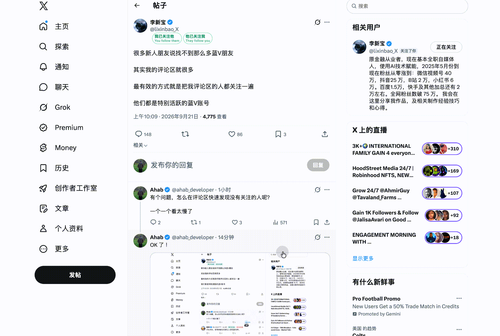

# X Follow Status



An unpacked Manifest V3 Chrome/Chromium extension that adds two bilingual, two-line badges next to each loaded post or reply on X:

- `我已关注他` / `我未关注他` with `You follow them` / `You don't follow them`
- `他已关注我` / `他未关注我` with `They follow you` / `They don't follow you`

It observes X's existing `TweetDetail`, `TweetResultByRestId`, and user-detail responses in the logged-in tab. It never sends a follow, unfollow, or other account action.

## Verified followers highlight

On a profile's `/<handle>/verified_followers` page, the extension gives any person you do **not** follow back a red outline and a `未关注 / Not following` label. It uses the `following: false` relationship field from X's existing `BlueVerifiedFollowers` response; it does not press X's **Follow back** button.

## Install locally

1. Open `chrome://extensions`.
2. Enable **Developer mode**.
3. Select **Load unpacked** and choose this directory.
4. Refresh an already-open X tab, then open a post or replies page.

The extension only sees new X responses after it has loaded. X's internal GraphQL schema can change, so a future X web update may require adjusting the response matcher or relationship field path.

## Privacy and permissions

- Runs only on `x.com` and `twitter.com` pages.
- Reads relationship fields already returned to the signed-in X tab; it does not call X's follow or unfollow endpoints.
- Does not send data to a server, use analytics, or persist account data.
- Has no background worker, storage permission, or access to pages outside X.

## Verify

```sh
node --test relationship-parser.test.js
node --check relationship-parser.js
node --check response-matcher.js
node --check page-hook.js
node --check content.js
node -e 'JSON.parse(require("node:fs").readFileSync("manifest.json", "utf8"))'
```
