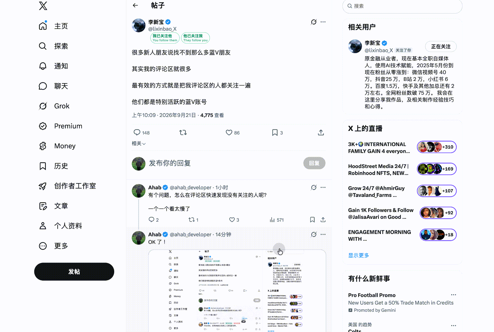

# X Follow Status



在 X 的帖子、评论和关注列表中识别双方的关注关系，并把帖子或回复草稿一键翻译成英文。

An unpacked Manifest V3 Chrome/Chromium extension that shows follow relationships directly on X and translates post or reply drafts to English. It never follows, unfollows, posts, or changes your account relationships.

## Translate posts and replies to English

The extension adds a `Trans` button immediately to the left of X's `Post` and `Reply` buttons. Write a post or reply in any supported language and select `Trans` to replace the draft with its English translation. The translated draft remains editable and is never posted automatically.

Translation uses the Translator and Language Detector APIs built into Chrome 138 and newer. Chrome downloads the required language model on first use, then translates the draft on-device with English as the target language.

## Posts and replies

Each loaded post or reply gets one compact, bilingual two-line badge when both directions of the relationship are available:

| Relationship | Badge | Color |
| --- | --- | --- |
| You follow each other | `互关`<br>`Mutual follow` | Blue |
| You follow them; they do not follow you | `未回关我`<br>`Not following you` | Red |
| They follow you; you do not follow them | `待回关他`<br>`You don't follow them` | Yellow |
| Neither account follows the other | `新朋友`<br>`New friend` | Green |

If either relationship direction is absent from X's loaded data, no badge is shown rather than guessing.

## Follow lists

The extension adds a persistent red outline without changing your account. The outline stays visible on hover and does not add a text label:

- On `/<handle>/following`, it marks people you follow who do **not** follow you (`following: true`, `followed_by: false`).
- On `/<handle>/verified_followers`, it marks people you do **not** follow back (`following: false`).

On `/<handle>/following`, use the fixed top-right button `滚动到下个没关注我的人 / Next non-follower` to find the next red-outline account. Each account is visited at most once on the current profile route. When none of the already-loaded accounts remains, the page scrolls down and stops as soon as X loads the next match.

## How it works

It observes X's existing `TweetDetail`, `TweetResultByRestId`, user-detail, `Following`, and `BlueVerifiedFollowers` responses in the logged-in tab. It does not make follow or unfollow requests. Draft translation runs only after you select `Trans` and uses Chrome's on-device translation model.

## Install locally

1. Open `chrome://extensions`.
2. Enable **Developer mode**.
3. Select **Load unpacked** and choose this directory.
4. Open or return to X. Chrome refreshes already-open X tabs when the unpacked extension is installed or reloaded so stale content scripts cannot continue running.

The extension only sees new X responses after it has loaded. X's internal GraphQL schema can change, so a future X web update may require adjusting the response matcher or relationship field path.

## Privacy and permissions

- Runs only on `x.com` and `twitter.com` pages.
- Reads relationship fields already returned to the signed-in X tab; it does not call X's follow or unfollow endpoints.
- When you select `Trans`, Chrome translates the current post or reply draft on-device. The draft is not sent to an extension server or translation endpoint.
- Does not use analytics or persist account data or drafts.
- Requests access only to X and Twitter pages. The `scripting` permission schedules one page refresh after an extension update. A lifecycle guard catches manual unpacked-extension reloads and asks the browser to refresh after activation, so an old X page cannot retain an invalid extension context.
- Uses a background service worker only when the extension is installed or updated; it schedules the page refresh and does not read or store drafts.

## Verify

```sh
node --test relationship-parser.test.js translation-api.test.js editor-text.test.js background.test.js
node --check background.js
node --check relationship-parser.js
node --check response-matcher.js
node --check relationship-display.js
node --check editor-text.js
node --check page-hook.js
node --check content.js
node --check translation-api.js
node -e 'JSON.parse(require("node:fs").readFileSync("manifest.json", "utf8"))'
```
